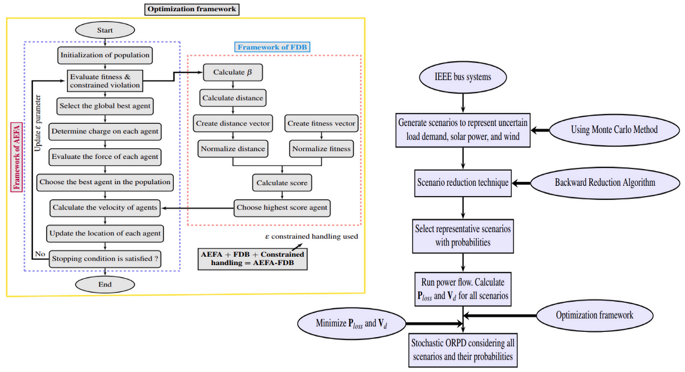

# AEFA-FDB

# AEFA-FDB: A Physics-Inspired Metaheuristic for Stochastic Optimal Reactive Power Dispatch (ORPD)

**
*Figure: Overview of the AEFA-FDB Framework for Stochastic ORPD*

## 🔋 Overview

**Optimal Reactive Power Dispatch (ORPD)** is essential for maintaining power system reliability, particularly in modern grids with high **renewable energy penetration**. This repository presents **AEFA-FDB**, a metaheuristic algorithm that integrates physical principles and learning strategies to solve the **stochastic ORPD problem** efficiently.

AEFA-FDB is enhanced with:
- A **Fitness Distance-Based (FDB) learning** mechanism
- **Historical data utilization** for improved adaptability
- A **nonlinear adaptive weight strategy** for exploration-exploitation trade-off
- **Monte Carlo simulations** to model uncertainties from **solar PV**, **wind**, and **hydropower**

---

## 🚀 Key Features

- ⚡ Efficient optimization of reactive power flow in stochastic settings
- 📉 Significant **reduction in active power loss**
- ⚖️ Improved **voltage profile and system stability**
- 🌐 Tested on standard IEEE 30, 57, and 118 bus systems
- 📊 Outperforms state-of-the-art algorithms across multiple benchmarks

---

## 📊 Results Summary

| Test System | Power Loss (mW) | Voltage Deviation (p.u.) |
|-------------|------------------|---------------------------|
| IEEE 30     | 4.4138           | 0.0884                    |
| IEEE 57     | 18.574           | 0.6031                    |
| IEEE 118    | 58.600           | 0.8110                    |

- Up to **18% improvement** in power loss
- Up to **43% improvement** in voltage deviation
---

## 🧠 Algorithm Highlights

- **AEFA-FDB**: Adaptive Electric Field Algorithm with Fitness Distance-Based Learning
- **Uncertainty Modeling**: Monte Carlo sampling for RES fluctuations
- **Exploration/Exploitation Control**: Adaptive nonlinear weight decay
- **Hybridization**: Integration of historical best solutions to guide search

---

## 🔧 How to Run

 Run the algorithm:
 main_FDBAEFA

## 📄 Citation
If you use this work in your research, please cite:
```bibtex
@article{chauhan2025aefa,
  title={AEFA-FDB: A score-based artificial electric field algorithm for optimal reactive power dispatch problem with renewable and load demand uncertainties},
  author={Chauhan, Dikshit and Yadav, Anupam and Cho, Sung-Bae},
  journal={Applied Soft Computing},
  pages={113292},
  year={2025},
  publisher={Elsevier}
}
```
---
## 🤝 Contact
For any queries, suggestions, or collaborations:

📧 Email: dikshitchauhan608@gmail.com

🌐 https://sites.google.com/view/dikshitchauhan/home
